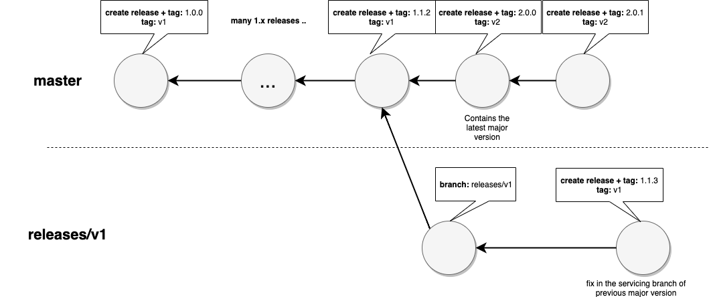

# 版本控制

操作是从 GitHub 仓库图中下载和运行的。工作流使用引用引用一个操作。

示例：

```yaml
steps:
    - uses: actions/javascript-action@v1        # 推荐使用。初始工作流使用这个
    - uses: actions/javascript-action@v1.0.0    # 如果一个操作提供特定的版本发布
    - uses: actions/javascript-action@41775a4da8ffae865553a738ab8ac1cd5a3c0044 # sha
```

# 兼容性

与主版本绑定是该主版本的最新版本（例如 `v1` == "1.*"）

主版本应保证兼容性。主版本可以添加全新的功能，但不应破坏现有的输入兼容性或破坏现有的工作流。

主版本绑定允许您利用错误修复、关键功能和安全修复。`main` 分支具有最新的代码，并且不稳定，因为更改将提交到 main 并通过创建标签发布到市场。此外，带有破坏性更改的新主版本将在从先前的主版本分支出的 main 中实现。

> 警告：不要引用 `main`，因为那是最新的代码，可能携带下一个主版本的破坏性更改。

```yaml
steps:
    - uses: actions/javascript-action@main  # 不要这样做
```

与不变的完整 sha1 绑定可能提供更高的可靠性。然而，请注意，托管的镜像工具集（例如 ubuntu-latest）在前进，如果有工具破坏问题，操作可能会通过对主版本的补丁来应对，以弥补因此绑定到特定 SHA 可能阻止您获取修复的问题。

> 建议：绑定到主版本以获得功能和修复，但保留绑定到特定发布或 SHA 作为应对未预见故障的策略。

# 建议

1. **为每个特定版本创建一个 GitHub 发布版**：创建一个类似于 [v1.0.0](https://github.com/actions/javascript-action/releases/tag/v1.0.0) 的发布版允许用户返回到特定版本，如果最新主版本遇到问题。

2. **将特定版本发布到市场**：当您发布特定版本时，请选择“将此操作发布到 GitHub 市场”的选项。


3. **使新版本对于绑定到主版本标签的人可用**：将主版本标签（v1、v2 等）移动到指向当前发布的引用。这将充当该主版本的稳定发布。您应该将此标签更新为最新的稳定次要/补丁发布。

```
git tag -fa v1 -m "Update v1 tag"
git push origin v1 --force
```
# 主版本

每个主版本的所有发布版都应具有兼容性，包括输入兼容性和行为兼容性。

引入一个主版本以进行兼容性破坏和操作的主要重写。

理想情况下，主版本应为用户提供其他好处，以诱使他们升级他们的工作流。由于更新工作流需要对更改有了解，并且需要了解哪些兼容性被破坏，因此引入新的主版本不应轻率进行。

为了获得反馈并设置期望，可以首先使用 `v2-beta` 标签发布新的主版本，以指示您可以尝试它，但仍在进行一些更改。发布后，可以删除 `-beta`，并从那时开始，预期将与之后的兼容性一致。

[查看带有 checkout 的 v2-beta 的示例](https://github.com/actions/checkout/tree/c170eefc2657d93cc91397be50a299bff978a052#checkout-v2-beta)

# 示例工作流程

这说明了上述版本控制的工作流程。


