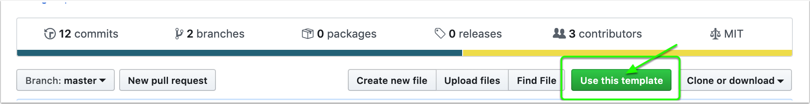

# 创建 Docker 操作

[container-template](https://github.com/actions/container-template) 存储库包含创建 Docker 操作的基本文件。

# 从模板创建仓库

导航到 https://github.com/actions/container-template

单击 `Use this template` 以为您的操作创建存储库。



完成创建您的存储库并克隆存储库。

> 注意：存储库的位置将是用户在工作流文件中使用 `using` 关键字引用操作的方式。

例如，要使用 https://github.com/actions/setup-node，用户将编写：

```yaml
steps:
    using: actions/setup-node@v3
```

# 定义元数据

您的操作有一个名称和描述。更新作者信息。

创建工作单元所需的输入。这将是工作流作者使用 `with:` 关键字设置的内容。

```yaml
name: 'My Container Action'
description: 'Get started with Container actions'
author: 'GitHub'
inputs: 
  myInput:
    description: 'Input to use'
    default: 'world'
runs:
  using: 'docker'
  image: 'Dockerfile'
  args:
    - ${{ inputs.myInput }}
```

它将使用 docker 运行，输入将映射到 args 中。

# 更改代码

入口点在 entrypoint.sh 中

```bash
#!/bin/sh -l

echo "hello $1"
```

# 发布

只需推送您的操作即可发布。

```bash
$ git push
```

运行时，运行程序将下载操作并动态构建 Docker 容器。

> 考虑使用标签对您的操作进行版本控制。请参阅[版本控制](/docs/action-versioning.md)。