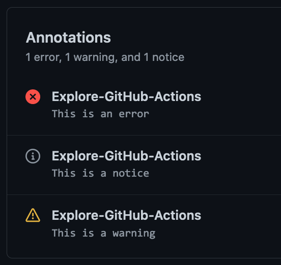

# `@actions/core`

> 用于在操作之间设置结果、日志记录、注册机密和导出变量的核心功能

## 用法

### 导入包

```js
// JavaScript
const core = require('@actions/core');

// TypeScript
import * as core from '@actions/core';
```

#### 输入/输出

可以使用 `getInput` 读取操作输入，它返回一个 `string`，或者使用 `getBooleanInput` 根据 [yaml 1.2 规范](https://yaml.org/spec/1.2/spec.html#id2804923) 解析布尔值。如果 `required` 设置为 false，则输入应在 `action.yml` 中具有默认值。

可以使用 `setOutput` 设置输出，使它们可用于映射到其他操作的输入，以确保它们解耦。

```js
const myInput = core.getInput('inputName', { required: true });
const myBooleanInput = core.getBooleanInput('booleanInputName', { required: true });
const myMultilineInput = core.getMultilineInput('multilineInputName', { required: true });
core.setOutput('outputKey', 'outputVal');
```

#### 导出变量

由于每个步骤都在单独的进程中运行，您可以使用 `exportVariable` 将其添加到此步骤和将来的步骤环境块中。

```js
core.exportVariable('envVar', 'Val');
```

#### 设置机密

设置机密会在日志中掩码注册机密，以确保它不可见。

```js
core.setSecret('myPassword');
```

#### PATH 操作

为了使工具的路径在作业的其余部分中可用（而不更改计算机或容器的状态），可以使用 `addPath`。运行时将路径添加到作业的 PATH 中。

```js
core.addPath('/path/to/mytool');
```

#### 退出码

您应该使用此库为操作设置失败的退出码。如果未设置状态并且脚本运行完成，将导致成功。

```js
const core = require('@actions/core');

try {
  // 做一些事情
}
catch (err) {
  // setFailed 记录消息并设置失败的退出码
  core.setFailed(`Action failed with error ${err}`);
}
```

请注意，`setNeutral` 在 actions V2 中尚未实现，但等效功能正在计划中。

#### 日志记录

最后，此库提供一些用于日志记录的实用程序。请注意，调试日志默认情况下在日志中是隐藏的。可以通过启用 [步骤调试日志](../../docs/action-debugging.md#step-debug-logs) 来切换此行为。

```js
const core = require('@actions/core');

const myInput = core.getInput('input');
try {
  core.debug('在 try 块内');

  if (!myInput) {
    core.warning('未设置 myInput');
  }

  if (core.isDebug()) {
    // curl -v https://github.com
  } else {
    // curl https://github.com
  }

  // 做一些事情
  core.info('输出到操作构建日志');

  core.notice('这是一条消息，还将发出一个注释');
}
catch (err) {
  core.error(`错误 ${err}，操作可能仍会成功`);
}
```

此库还可以将输出的块包装在可折叠的组中。

```js
const core = require('@actions/core')

// 手动包装输出
core.startGroup('执行某些函数')
doSomeFunction()
core.endGroup()

// 包装异步函数调用
const result = await core.group('执行一些异步操作', async () => {
  const response = await doSomeHTTPRequest()
  return response
})
```

#### 注释

此库有 3 个方法将产生 [注释](https://docs.github.com/en/rest/reference/checks#create-a-check-run)。

```js
core.error('这是一个严重错误，操作可能仍然成功。')

core.warning('发生了一些错误，但不足以使构建失败。')

core.notice('发生了你可能想知道的事情。')
```

这些将在操作页面和拉取请求上显现出来。它们看起来像这样：



这些注释还可以附加到源文件的特定行和列，以显示问题的确切位置。

选项如下：
```typescript
export interface AnnotationProperties {
  /**
   * 注释的标题。
   */
  title?: string

  /**
   * 注释应创建的文件的名称。
   */
  file?: string

  /**
   * 注释的起始行。
   */
  startLine?: number

  /**
   * 注释的结束行。当提供了 `startLine` 时，默认为 `startLine`。
   */
  endLine?: number

  /**
   * 注释的起始列。在 `startLine` 和 `endLine` 是不同值时，不能发送。
   */
  startColumn?: number

  /**
   * 注释的结束列。在 `startLine` 和 `endLine`

 是不同值时，不能发送。
   * 当提供了 `startColumn` 时，默认为 `startColumn`。
   */
  endColumn?: number
}
```

#### 样式化输出

在操作日志中支持通过标准 [ANSI 转义代码](https://en.wikipedia.org/wiki/ANSI_escape_code) 的彩色输出。支持 3/4 位、8 位和 24 位颜色。

前景颜色：

```js
// 3/4 位
core.info('\u001b[35m这个前景将是洋红色')

// 8 位
core.info('\u001b[38;5;6m这个前景将是青色')

// 24 位
core.info('\u001b[38;2;255;0;0m这个前景将是亮红色')
```

背景颜色：

```js
// 3/4 位
core.info('\u001b[43m这个背景将是黄色');

// 8 位
core.info('\u001b[48;5;6m这个背景将是青色')

// 24 位
core.info('\u001b[48;2;255;0;0m这个背景将是亮红色')
```

特殊样式：

```js
core.info('\u001b[1m粗体文本')
core.info('\u001b[3m斜体文本')
core.info('\u001b[4m下划线文本')
```

ANSI 转义代码可以彼此组合：

```js
core.info('\u001b[31;46m红色前景与青色背景和\u001b[1m粗体文本结尾');
```

> 注意：转义代码在每行开头重置

```js
core.info('\u001b[35m这个前景将是洋红色')
core.info('这个前景将重置为默认')
```

手动输入转义代码可能有点困难，但可以使用第三方模块，例如 [ansi-styles](https://github.com/chalk/ansi-styles)。

```js
const style = require('ansi-styles');
core.info(style.color.ansi16m.hex('#abcdef') + '你好，世界！')
```

#### 操作状态

您可以使用此库保存状态并获取状态，以在给定的包装操作之间共享信息：

 **action.yml**：

```yaml
name: 'Wrapper action sample'
inputs:
  name:
    default: 'GitHub'
runs:
  using: 'node12'
  main: 'main.js'
  post: 'cleanup.js'
```

在操作的 `main.js` 中：

```js
const core = require('@actions/core');

core.saveState("pidToKill", 12345);
```

在操作的 `cleanup.js` 中：

```js
const core = require('@actions/core');

var pid = core.getState("pidToKill");

process.kill(pid);
```

#### OIDC 令牌

您可以使用这些方法与 GitHub OIDC 提供程序交互，并获取 JWT ID 令牌，该令牌将有助于从第三方云提供商获取访问令牌。

 **方法名**：getIDToken()

 **输入**

audience：可选

 **输出**

[JWT](https://jwt.io/) ID 令牌

在操作的 `main.ts` 中：

```js
const core = require('@actions/core');
async function getIDTokenAction(): Promise<void> {
  
   const audience = core.getInput('audience', {required: false})
   
   const id_token1 = await core.getIDToken()            // 默认受众的 ID 令牌
   const id_token2 = await core.getIDToken(audience)    // 自定义受众的 ID 令牌
   
   // 此 id_token 可用于从第三方云提供商获取访问令牌
}
getIDTokenAction()
```

在操作的 `actions.yml`：

```yaml
name: 'GetIDToken'
description: 'Get ID token from Github OIDC provider'
inputs:
  audience:  
    description: 'Audience for which the ID token is intended for'
    required: false
outputs:
  id_token1: 
    description: 'ID token obtained from OIDC provider'
  id_token2: 
    description: 'ID token obtained from OIDC provider'
runs:
  using: 'node12'
  main: 'dist/index.js'
```

#### 文件系统路径助手

您可以使用这些方法在各种操作系统上操作文件路径。

`toPosixPath` 函数将输入路径转换为 Posix 样式（Linux）路径。
`toWin32Path` 函数将输入路径转换为 Windows 样式路径。这些
函数独立于底层运行时操作系统工作。

```js
toPosixPath('\\foo\\bar') // => /foo/bar
toWin32Path('/foo/bar') // => \foo\bar
```

`toPlatformPath` 函数将输入路径转换为运行时操作系统上预期的值。

```js
// 在 Windows 运行时上。
toPlatformPath('/foo/bar') // => \foo\bar

// 在 Linux 运行时上。
toPlatformPath('\\foo\\bar') // => /foo/bar
```

#### 平台助手

提供获取有关操作正在运行的平台信息的简写。

```js
import { platform } from '@actions/core'

/* 等同于调用 os.platform() */
platform.platform // 'win32' | 'darwin' | 'linux' | 'freebsd' | 'openbsd' | 'android' | 'cygwin' | 'sunos'

/* 等同于调用 os.arch() */
platform.arch // 'x64' | 'arm' | 'arm64' | 'ia32' | 'mips' | 'mipsel' | 'ppc' | 'ppc64' | 'riscv64' | 's390' | 's390x'

/* 用于平台特定逻辑的常用简写 */
platform.isWindows // true
platform.isMacOS // false
platform.isLinux // false

/* 运行平台特定脚本以获取有关确切平台的更多详细信息，在 Windows、MacOS 和 Linux 上都可以工作 */
const {
  name, // Microsoft Windows 11 Enterprise
  version, // 10.0.22621
} = await platform.getDetails()
```